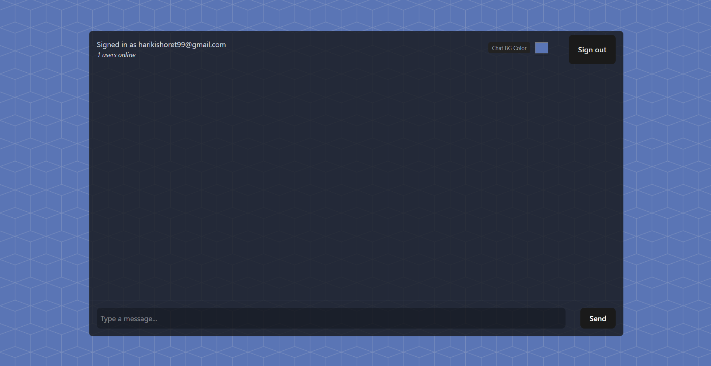

# 🗨️ Realtime Chat App using React + Supabase

A minimal yet powerful realtime chat application built with **React** and **Supabase**, featuring Google Auth, Presence tracking, and live message broadcasting.

 <!-- optional: replace with actual path -->

---

## 🚀 Features

- ✅ Google OAuth login (via Supabase)
- 💬 Realtime messaging with Supabase Realtime Broadcast API
- 👥 Online users list (presence tracking)
- 📦 Responsive UI with Tailwind CSS
- 🌐 Automatic scroll-to-bottom for messages
- 🧼 Clean component structure with React Hooks

---

## 🛠️ Tech Stack

| Tech            | Purpose                       |
|-----------------|-------------------------------|
| React           | UI framework                  |
| Supabase        | Backend-as-a-service (BaaS)   |
| Tailwind CSS    | Styling                       |
| Vite            | Fast dev + build tool         |

---

## 🔧 Setup Instructions

1. **Clone the repo**

```bash
git clone https://github.com/HariKishore7/Realtime-Chat-Supabase
cd Realtime-chat-supabase
npm install